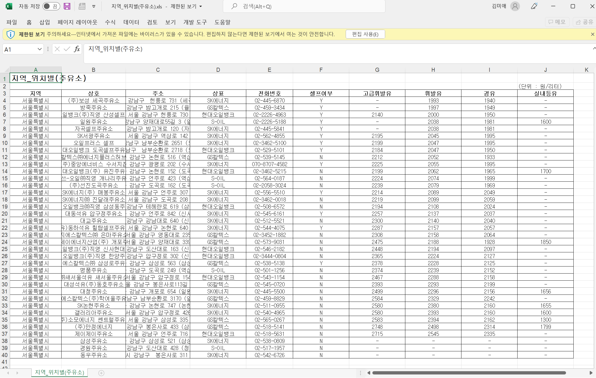

4-1

```python
from selenium.webdriver.chrome.service import Service
from selenium.webdriver.common.by import By
s = Service('../driver/chromedriver')
driver = webdriver.Chrome(service=s)
driver.get("http://naver.com")
```

4-2 엑셀파일 불러오기 성공




4-4

```python
import time
#tqdm 안쓰고 하기
for gu in gu_names:
    element = driver.find_element_by_id("SIGUNGU_NM0")
    element.send_keys(gu)

    time.sleep(2)

    xpath = """//*[@id="searRgSelect"]"""
    element_sel_gu = driver.find_element_by_xpath(xpath).click()

    time.sleep(1)

    xpath = """//*[@id="glopopd_excel"]"""
    element_get_excel = driver.find_element_by_xpath(xpath).click()

    time.sleep(1)
```


4-6

```python
from tqdm import tqdm
```

